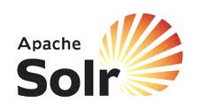

## SOLR Monitoring FastPack

 The dynaTrace
FastPack for the SOLR enables easy out-of-the-box monitoring for applications using the SOLR Search Engine. The FastPack consists predefined JMX Measures for SOLR, Sensors for SOLR Server and SOLR
Clients, Business Transactions a Template Profile and Dashboards.

Find further information in the [dynaTrace community](https://community.compuwareapm.com/community/display/DL/SOLR+Monitoring+FastPack) 