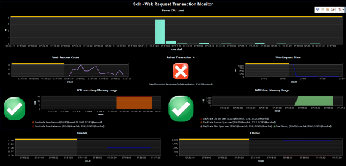
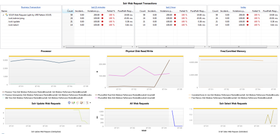

# SOLR Monitoring FastPack

## Overview

 The dynaTrace
FastPack for the SOLR enables easy out-of-the-box monitoring for applications using the SOLR Search Engine. The FastPack consists predefined JMX Measures for SOLR, Sensors for SOLR Server and SOLR
Clients, Business Transactions a Template Profile and Dashboards.

## Fast Pack Details

| Name |SOLR Monitoring FastPack
| :--- | :---
| Author | Keith Marshall
| Supported dynaTrace Version | >= 5.5
| License | [dynaTrace BSD](dynaTraceBSD.txt)
| Support | [Community Supported](https://community.compuwareapm.com/community/display/DL/Support+Levels#SupportLevels-Community+Supported)  
| Release History | Version 1.0.0
| Download | [SOLR Fastpack for dynaTrace 6.x](SOLRMonitoringFastPack_dynaTrace6.dtp)

## SOLR Environmental Monitor

This dashboard looks at the environmental factors related to the SOLR application server. CPU Load is observed with heap and non-heap memory usage. Web request time and counts are included with a
failed transaction traffic light alert. This alert may be adjusted to the % preferred. Class and Thread data are also included.

## SOLR Web Requests

The SOLR Web Requests Dashboard provides a Business Transaction like view of all the /SOLR requests. Easy drill down to the transaction details from here. To provide a more detailed operational view
we have included charting for all web requests, /SEARCH and /UPDATE specific SOLR web requests. To round out this view the Processor, Free/Comitted memory, and Disk Read/Writes are also charted here.

## FastPack Information

The Fastpack contains a Dashboard and a Template System Profile. In addition it contains the two dashboards described above.  
The System Profile already contains an Agent Group for SOLR, just add the dynaTrace agent to your JVM_OPTS when starting SOLR (use name=SOLR). This agent group contains some minor modifications to
allow optimal monitoring of SOLR.

## Installation

Just download and import the FastPack on your dynaTrace Server (see [Plugin Management](https://community.compuwareapm.com/community/display/DOCDT40/Plugin+Management))  
If you start with a fresh system simply copy the provided System profile (to give it an application specific name) and add agent groups for your own application. If you want to use Cassandra in an
existing System profile please copy the following items to your system profile.

  * SOLR Business Transactions 

  * the SOLR Agent Group cannot be copied please do the following 

    * Create a separate agent group for SOLR 

